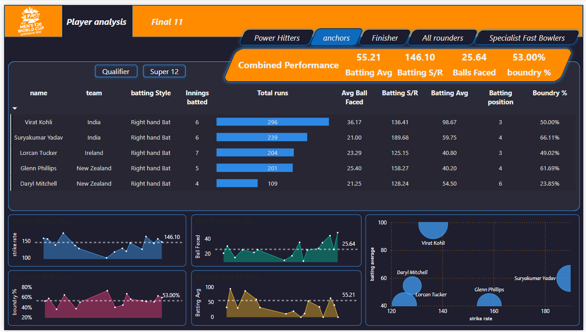

#  PowerPlay XI – Data-Driven Cricket Team Builder

**PowerPlay XI** is a comprehensive Power BI dashboard designed to help analysts and cricket fans build a data-driven playing XI from ICC T20 World Cup player statistics. It uses cleaned `.csv` data, DAX measures, Power Query, and Python preprocessing.

---

##  Objective

> “We don’t know the strengths and weaknesses of our opponents, but give me the best 11 t-20 team from this planet.based on t-20 world cup 2022”

Build a t-20 team that can:
- **Score at least 180 runs on average**
- **Defend at least 150 runs on average**

---

##  Data Sources & Processing

###  Raw Data
- `player_info.json`
- `batting_data.json`
- `bowling_data.json`
- `match_summary.json`

###  Cleaned CSV Files
- `cleaned_player_info.csv`
- `cleaned_batting_data.csv`
- `cleaned_bowling_data.csv`
- `cleaned_match_summary.csv`

###  Preprocessing Notebook
- `data_preprocessing.ipynb` – Jupyter Notebook used to:
  - Load and clean raw JSON files
  - Handle missing values
  - Normalize nested structures
  - Export cleaned `.csv` files

---

##  Tools & Workflow

- **Python (Pandas)** – For data cleaning and CSV generation
- **Power BI Power Query** – For final transformations and data modeling
- **DAX** – 20+ custom measures and calculated columns
- **Jupyter Notebook** – Tracked and reproducible preprocessing steps

---

##  Dashboard Highlights

-  Final XI Selector with dynamic filters
-  KPIs: Strike Rate, Boundary %, Dot Ball %, Bowling Avg, etc.
-  Role classification based on defined logic
-  Player comparison visualizations
-  Day-wise trend charts

---

##  Role Parameters 

###  Openers
- **Batting Avg > 30** – Avg. runs per innings
- **Strike Rate > 140** – (Runs ÷ Balls) × 100
- **Innings Batted > 3** – Reliable sample size
- **Boundary % > 50%** – Aggressive scoring
- **Batting Position < 4** – Top-order players

###  Anchors / Middle Order
- **Batting Avg > 40**
- **Strike Rate > 125**
- **Avg. Balls Faced > 20**
- **Batting Position > 2**
- **Innings Batted > 3**

###  Finishers / Lower Order
- **Batting Avg > 25**
- **Strike Rate > 130**
- **Avg. Balls Faced > 12**
- **Batting Position > 4**
- **Innings Batted > 3**

###  All-Rounders
- **Batting Avg > 15**
- **Strike Rate > 140**
- **Bowling Economy < 7**
- **Bowling SR < 20**
- **Innings Bowled > 2**

###  Specialist Fast Bowlers
- **Bowling Style = %Fast%**
- **Bowling SR < 16**
- **Dot Ball % > 40%**
- **Bowling Avg < 20**
- **Innings Bowled > 4**

##  Dashboard Screenshots
  
###  start building your world cup t20 team

###  select openers

###  decide on middle order / anchors

###  decide your finishers

###  select all rounders

### bring in fast bowlers

### final team

---

##  Files Included

- `my_cricket_team.pdf` – Dashboard overview
- `PowerPlayXI.pbix` – Power BI dashboard file 
- `data_preprocessing.ipynb` – Jupyter Notebook
- Cleaned Data:
  - `cleaned_player_info.csv`
  - `cleaned_batting_data.csv`
  - `cleaned_bowling_data.csv`
  - `cleaned_match_summary.csv`

---

##  References

YouTube Source  
[T20 Team Selection in Power BI – by How To Power BI](https://youtu.be/4QkYy1wANXA?si=dycyrPOd7iGCdFdz)

---

##  Author

**Shreyas Auti**
*Business Analyst | Data Visualizer
 Email    :- shreyas.auti.2001@gmail.com 
 Linkedin :- https://www.linkedin.com/in/shreyas-auti-301a21175/ 

---

##  License

This project is open for learning and portfolio use. Commercial use is not allowed without permission.

---

